## Blast Arena

> 👨‍💻 Developed by Matheus Ramalho de Oliveira  
🏗️ Brazilian Software Engineer  
✉️ kastorcode@gmail.com  
🦫 [LinkedIn](https://br.linkedin.com/in/kastorcode) • [Instagram](https://instagram.com/kastorcode)

---

Blast Arena is a browser based, battle royale and online multiplayer game. With old school 2D graphics and a nostalgic soundtrack, 4 players compete for victory using bombs on a board. The game has more than 27 characters and scenarios, has power ups and support for controller, keyboard and touch screen. You can play with your friends and also pair up with anyone in the world, it has a lobby system, nickname, call and full-screen.

---

### Screenshots

  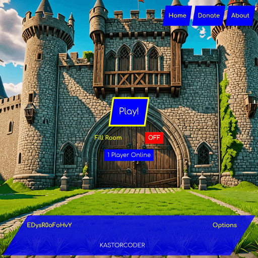
  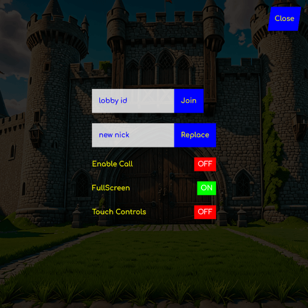
  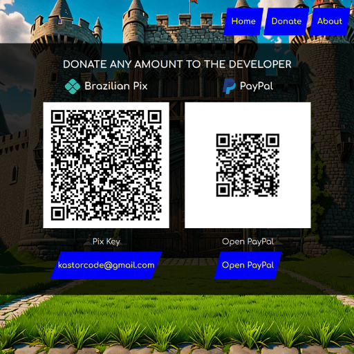
  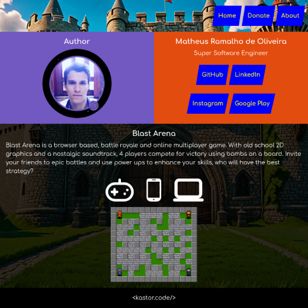
  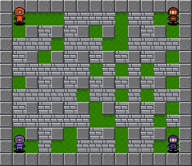
  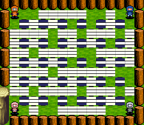
  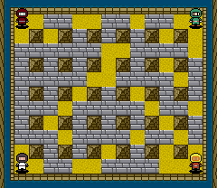
  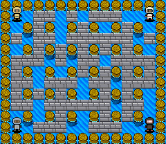
  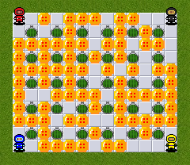
  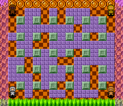
  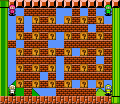
  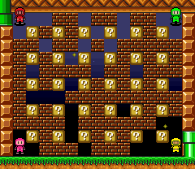

---

### Installation and execution

Backend

1. Make a clone of this repository;
2. Open the `server` folder in a terminal;
3. Run `yarn` to install dependencies;
4. Run `yarn dev` to start the nodemon development server at port `4000`.

Frontend

1. Open the `client` folder in a terminal;
2. Run `yarn` to install dependencies;
3. Run `yarn dev` to start the craco development server at `https://192.168.2.81:3000/blast-arena`.

---

  <big><b>&lt;kastor.code/&gt;</b></big>

